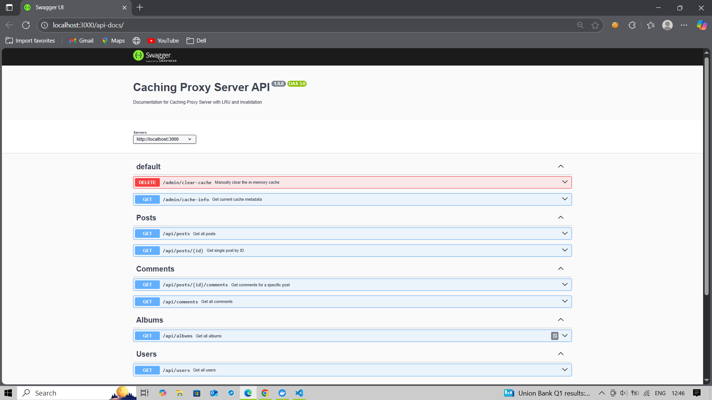

#  Caching Proxy Server - v1(In-memory Javascript cache object)

## 📁 Project Structure

```bash
.
├── app.js
├── routes/
│   └── proxy.js
│   └── admin.js
├── services/
│   └── cacheService.js
├── swagger/
│   └── swagger.js
├── Dockerfile
├── .dockerignore
├── README.md
└── package.json
```
## How to Run the Project (Using Docker)
- Prerequisites
  
Docker Desktop must be installed & running.

**Step 1: Clone the Repo**
```bash
git clone https://github.com/your-username/caching-proxy-server.git
cd caching-proxy-server
```

**Step 2: Build the Docker Image**
```bash
docker build -t caching-proxy:v1 .
```

This command reads the Dockerfile and builds an isolated Docker image for your project.

**Step 3: Run the Container**
```bash
docker run -p 3000:3000 caching-proxy:v1
```

**Step 4: Access Swagger API Docs**
```bash
http://localhost:3000/api-docs
```

Use Swagger UI to test all available endpoints.



## 🧪 How to Test APIs in Swagger

This project uses **Swagger UI** to test and visualize API behavior for the caching system implemented in **Version 1**.

---

### 📄 Project Description

This backend project demonstrates **manual caching logic** using in-memory JavaScript objects. It includes API routes that:

- 🔁 Create cache entries (by fetching from external server)
- 👀 Retrieve data from cache (if available)
- ❌ Manually delete cache entries (for testing purposes)

---

### 🔍 Caching APIs (Data Fetching)

The following sections hit the external server and then store data in cache:

- `/posts`
- `/comments`
- `/albums`
- `/users`

📌 **Behavior**:
- **First hit** → Data is fetched from the server and cached
- **Subsequent hits** → Data is served directly from cache

---

### 🛡️ Admin APIs (Cache Management)

The `admin` section exposes two key endpoints:

#### 1. `GET /admin/cache-info`

- Shows the **current cache status**
- Displays:
  - Number of keys in cache
  - Key names
  - Cache usage queue (used for LRU logic)
- Helps you understand how **Least Recently Used (LRU)** logic automatically removes old cache data when the limit exceeds.

#### 2. `DELETE /clear-cache`

- Deletes the **entire cache manually**
- Useful for **testing or resetting** the cache
- Admins or developers can use this to start fresh

---

### 🧠 Behind the Scenes

- The cache uses a JavaScript object to store data
- LRU (Least Recently Used) logic is applied using a usage queue
- Cache limit is set to a maximum of 5 keys
- If the cache is full, the oldest used key is automatically removed (visible in `/admin/cache-info`)
- Time-based **cache invalidation** is also applied (1-minute expiry)

---

### 🚀 Swagger Access Instructions

- Run the server using Docker or Node
- Visit `http://localhost:3000/api-docs` to open Swagger UI
- Test any API like `/posts`, `/users`, etc.
- Use `GET /admin/cache-info` to inspect the current cache
- Use `DELETE /clear-cache` to clear it manually

---

Let me know if you also want instructions on how to test all this using Docker or Postman.


---
---


# Caching Proxy Server
A simple proxy server built with Node.js and Express that implements in-memory caching to optimize repeated API calls and reduce network latency.

---
## What is Caching?
**Caching** is a technique used to temporarily store frequently accessed data so that future requests for that data can be served faster without hitting the original source again.
It helps improve application performance, reduce server load, and minimize response time.
For example: Instead of calling an external API every time, we store the response once and serve it directly from the cache for subsequent requests.

---
## What is In-Memory Caching?
In-memory caching stores data directly in the server's memory (RAM), allowing extremely fast data access. In this project, I use a simple **JavaScript object** as our in-memory store to hold cached API responses.
This method is:

- Lightweight
  
- Fast
  
- Easy to implement
  
- Best suited for small-scale apps or low-traffic use-cases
  
However, since it's stored in memory, the data is lost when the server restarts.

---
## Note: Only GET Requests Are Cached
In this proxy server project, only GET requests are cached, and here's why:
GET requests are used only to fetch data from the server. They do not modify or update any data.
Since the same GET request usually returns the same response, it makes sense to store it in memory (cache) and reuse it when the same request comes again.
This approach helps to reduce server load and improves response time for repeated requests.
## Why Not Cache POST, PUT, or DELETE Requests?
POST is used to send new data to the server. The response might change with every request.

PUT or PATCH is used to update existing data. If we cache it, we might serve outdated data.

DELETE removes data from the server. If we return cached data after deletion, it can cause inconsistency.

So to keep things safe and accurate, I are only caching GET requests in this project.

---
## Cache Invalidation (In-Memory)
Cache invalidation ensures that stale (old or expired) data is not served from cache. In this project, I’ve added a time-based invalidation mechanism.
How It Works:

-Every time a response is cached, we also store the timestamp (Date.now()).

-When the same GET request comes again:

-Cache is checked for that key.

-If the timestamp is older than 1 minute(1 minute takes due to testing purpose), the cached data is considered expired.

-Expired data is ignored, and a fresh request is sent to the actual API.

-The new response is then re-cached with a new timestamp.

-This time-based invalidation ensures that users don’t get outdated responses.

-It also keeps the memory footprint clean, avoiding stale data buildup.

---

## LRU(Least Recently Used) Caching
To optimize memory usage, we implement LRU caching in our proxy server.

 What is LRU?

LRU (Least Recently Used) is a cache eviction policy which removes the least recently used item when the cache is full.

We maintain:

-A cache object: stores actual data

-A usageQueue array: tracks usage order of keys

How It Works:
```
Usage Queue (Oldest → Newest):

["A", "B", "C", "D", "E"]  ← 5 keys in cache

Now you access "B" → move "B" to end
["A", "C", "D", "E", "B"]

Now new request comes → "F"
=> Cache full, so evict "A" (oldest)
Final Queue After Insertion:
["C", "D", "E", "B", "F"]
```
---

## Add Manual Cache Clear Endpoint

A manual cache clearing endpoint allows the **admin** or **system** to explicitly remove all cached data when needed. This is useful in situations where waiting for automatic cache invalidation (based on time or LRU logic) is not ideal.

###  Why We Add This Manually

Even though we have automatic cache expiration and LRU (Least Recently Used) eviction strategies in place, some scenarios demand full and immediate control over the cache. That’s where a manual clear endpoint becomes valuable.

###  Use Cases

- **Data Update on Server:** When the underlying data (on the real API or database) changes due to an update or bug fix, and you want the cache to be refreshed immediately.
- **Development and Debugging:** During development, developers may want to clear the cache frequently to test fresh data from the server.
- **Admin Control:** Provide operational teams with the ability to clear the cache without restarting the server or waiting for expiry.
- **Error Recovery:** In case the cache becomes corrupted or contains bad data, it can be cleared instantly.
- Add clear() method in cacheService.js to empty both cache and usageQueue.
---


## Add Cache Stats Endpoint
For debugging or monitoring cache.

---

4. Write README: Features + How It Works
Add a "How to Run", "Features", "Tech Stack", "How LRU Works", etc.

5. Add Redis Support (Advanced )
Current one is in-memory cache. Add a toggleable Redis cache (external memory-based).

6. Add Logging System (Optional)
Use morgan or winston to log every API call and cache hits/misses.

7. Deploy on Render / Railway / Cyclic
So you can share your live demo link on resume/GitHub.
---

